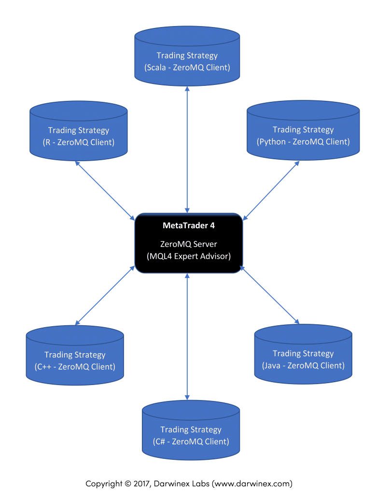
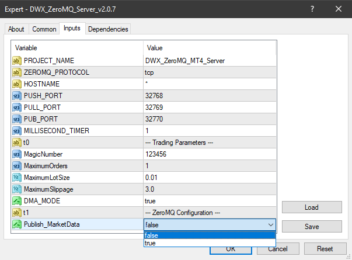

# DWX ZeroMQ Connector (Python 3 to MetaTrader 4)

## Table of Contents
* [Introduction](#introduction)
* [Installation](#installation)
* [Configuration](#configuration)
* [Example Usage](#example-usage)
* [Complete list of available functions](#available-functions)

## Introduction
In this project, we present a technique employing ZeroMQ (an Open Source, Asynchronous Messaging Library and Concurrency Framework) for building a basic – but easily extensible – high performance bridge between external (non-MQL) programming languages and MetaTrader 4.
	
**Reasons for writing this post:**

* Lack of comprehensive, publicly available literature about this topic on the web.
* Traders have traditionally relied on Winsock/WinAPI based solutions that often require revision with both Microsoft™ and MetaQuotes™ updates.
* Alternatives to ZeroMQ include named pipes, and approaches where filesystem-dependent functionality forms the bridge between MetaTrader and external languages.

**We lay the foundation for a distributed trading system that will:**

* Consist of one or more trading strategies developed outside MetaTrader 4 (non-MQL),
* Use MetaTrader 4 for acquiring market data, trade execution and management,
* Support multiple non-MQL strategies interfacing with MetaTrader 4 simultaneously,
* Consider each trading strategy as an independent “Client”,
* Consider MetaTrader 4 as the “Server”, and medium to market,
* Permit both Server and Clients to communicate with each other on-demand.

**Infographic: ZeroMQ-Enabled Distributed Trading Infrastructure (with MetaTrader 4)**


**Why ZeroMQ?**

* Enables programmers to connect any code to any other code, in a number of ways.
* Eliminates a MetaTrader user’s dependency on just MetaTrader-supported technology (features, indicators, language constructs, libraries, etc.)
* Traders can develop indicators and strategies in C/C#/C++, Python, R and Java (to name a few), and deploy to market via MetaTrader 4.
* Leverage machine learning toolkits in Python and R for complex data analysis and strategy development, while interfacing with MetaTrader 4 for trade execution and management.
* ZeroMQ can be used as a high-performance transport layer in sophisticated, distributed trading systems otherwise difficult to implement in MQL.
* Different strategy components can be built in different languages if required, and seamlessly talk to each other over TCP, in-process, inter-process or multicast protocols.
* Multiple communication patterns and disconnected operation.

## Installation

This project requires the following:

* **Python**: (minimum v3.6)
* **libzmq**: (minimum v4.2.5)
* **pyzmq**: (minimum v17.1.2)
* **libsodium** (https://github.com/jedisct1/libsodium)
* **mql4-lib** (https://github.com/dingmaotu/mql4-lib)
* **mql-zmq** (https://github.com/dingmaotu/mql-zmq)

For your convenience, files from the last three items above have been included in this repository with appropriate copyrights referenced within.

### Steps:

1. Download and unzip **mql-zmq-master.zip** (by GitHub author @dingmaotu)
1. Copy the contents of **mql-zmq-master/Include/Mql** and **mql-zmq-master/Include/Zmq** into your MetaTrader installation's **MQL4/Include** directory as-is. Your **MQL4/Include** directory should now have two additional folders "Mql" and "Zmq".
1. Copy **libsodium.dll** and **libzmq.dll** from **mql-zmq-master/Library/MT4** to your MetaTrader installation's **MQL4/Libraries** directory.
1. Download **DWX_ZeroMQ_Server_v2.0.7.mq4** and place it inside your MetaTrader installation's **MQL4/Experts** directory.
1. Finally, download **DWX_ZeroMQ_Connector_v1_0_8.py**.

## Configuration

1. After completing the steps above, terminate and restart MetaTrader 4.
1. Open any new chart, e.g. EUR/USD M, then drag and drop **DWX_ZeroMQ_Server_v2.0.7**.
1. Switch to the EA's Inputs tab and customize values as necessary:

    
1. Note: Setting **Publish_MarketData** to **True** will cause MetaTrader 4 to begin publishing BID/ASK tick data in real-time for all symbols specified in the array **Publish_Symbols** contained in the .mq4 script. 
1. Simply modify the Publish_Symbols[] aarray's contents to add/remove required symbols as necessary and re-compile. 
1. The default list of symbols is:

```
string Publish_Symbols[7] = {
   "EURUSD","GBPUSD","USDJPY","USDCAD","AUDUSD","NZDUSD","USDCHF"
};
```

## Example Usage

### Initialize Connector:
```
_zmq = DWX_ZeroMQ_Connector()
```

### Construct Trade to send via ZeroMQ to MetaTrader:
```
_my_trade = _zmq._generate_default_order_dict()

Output: 
{'_action': 'OPEN',
 '_type': 0,
 '_symbol': 'EURUSD',
 '_price': 0.0,
 '_SL': 500,
 '_TP': 500,
 '_comment': 'DWX_Python_to_MT',
 '_lots': 0.01,
 '_magic': 123456,
 '_ticket': 0}

_my_trade['_lots'] = 0.05

_my_trade['_SL'] = 250

_my_trade['_TP'] = 750

_my_trade['_comment'] = 'nerds_rox0r'
```

### Send trade to MetaTrader:
```
_zmq._DWX_MTX_NEW_TRADE_(_order=_my_trade)

# MetaTrader response (JSON):
{'_action': 'EXECUTION', 
'_magic': 123456, 
'_ticket': 85051741, 
'_open_price': 1.14414, 
'_sl': 250, 
'_tp': 750}
```

### Get all open trades from MetaTrader:
```
_zmq._DWX_MTX_GET_ALL_OPEN_TRADES_()

# MetaTrader response (JSON):

{'_action': 'OPEN_TRADES', 
'_trades': {
    85051741: {'_magic': 123456, 
                '_symbol': 'EURUSD', 
                '_lots': 0.05, 
                '_type': 0, 
                '_open_price': 1.14414, 
                '_pnl': -0.45}
    }
}
```

### Partially close 0.01 lots:
```
_zmq._DWX_MTX_CLOSE_PARTIAL_BY_TICKET_(85051741, 0.01)

# MetaTrader response (JSON):
{'_action': 'CLOSE', 
'_ticket': 85051741, 
'_response': 'CLOSE_PARTIAL', 
'_close_price': 1.14401, 
'_close_lots': 0.01}

# Partially closing a trade renews the ticket ID, retrieve it again.

_zmq._DWX_MTX_GET_ALL_OPEN_TRADES_()

# MetaTrader response (JSON):
{'_action': 'OPEN_TRADES', 
'_trades': {
    85051856: {'_magic': 123456, 
                '_symbol': 'EURUSD', 
                '_lots': 0.04, 
                '_type': 0, 
                '_open_price': 1.14414, 
                '_pnl': -0.36}
    }
}
```

### Close a trade by ticket:
```
_zmq._DWX_MTX_CLOSE_TRADE_BY_TICKET_(85051856)

# MetaTrader response (JSON):
{'_action': 'CLOSE', 
'_ticket': 85051856, 
'_close_price': 1.14378, 
'_close_lots': 0.04, 
'_response': 'CLOSE_MARKET', 
'_response_value': 'SUCCESS'}
```

### Close all trades by Magic Number:
```
# Before running the following example, 5 trades were executed using the same values as in "_my_trade" above, the magic number being 123456.

# Check currently open trades.

_zmq._DWX_MTX_GET_ALL_OPEN_TRADES_()

# MetaTrader response (JSON):
{'_action': 'OPEN_TRADES', 
    '_trades': {
        85052022: {'_magic': 123456, '_symbol': 'EURUSD', '_lots': 0.05, '_type': 0, '_open_price': 1.14353, '_pnl': 1.15}, 
        85052026: {'_magic': 123456, '_symbol': 'EURUSD', '_lots': 0.05, '_type': 0, '_open_price': 1.14354, '_pnl': 1.1}, 
        85052025: {'_magic': 123456, '_symbol': 'EURUSD', '_lots': 0.05, '_type': 0, '_open_price': 1.14354, '_pnl': 1.1}, 
        85052024: {'_magic': 123456, '_symbol': 'EURUSD', '_lots': 0.05, '_type': 0, '_open_price': 1.14354, '_pnl': 1.1}, 
        85052023: {'_magic': 123456, '_symbol': 'EURUSD', '_lots': 0.05, '_type': 0, '_open_price': 1.14356, '_pnl': 1}
    }
}

# Close all trades with magic number 123456
_zmq._DWX_MTX_CLOSE_TRADES_BY_MAGIC_(123456)

# MetaTrader response (JSON):
{'_action': 'CLOSE_ALL_MAGIC', '_magic': 123456, 
'_responses': {
    85052026: {'_symbol': 'EURUSD', '_close_price': 1.14375, '_close_lots': 0.05, '_response': 'CLOSE_MARKET'}, 
    85052025: {'_symbol': 'EURUSD', '_close_price': 1.14375, '_close_lots': 0.05, '_response': 'CLOSE_MARKET'}, 
    85052024: {'_symbol': 'EURUSD', '_close_price': 1.14375, '_close_lots': 0.05, '_response': 'CLOSE_MARKET'}, 
    85052023: {'_symbol': 'EURUSD', '_close_price': 1.14375, '_close_lots': 0.05, '_response': 'CLOSE_MARKET'}, 
    85052022: {'_symbol': 'EURUSD', '_close_price': 1.14375, '_close_lots': 0.05, '_response': 'CLOSE_MARKET'}}, 
'_response_value': 'SUCCESS'}
```

### Subscribe/Unsubscribe to/from EUR/USD bid/ask prices in real-time:
```
_zmq._DWX_MTX_SUBSCRIBE_MARKETDATA_('EURUSD')

Output:
[KERNEL] Subscribed to EURUSD BID/ASK updates. See self._Market_Data_DB.

# BID/ASK prices are now being streamed into _zmq._Market_Data_DB.
_zmq._Market_Data_DB

Output: 
{'EURUSD': {
  '2019-01-08 13:46:49.157431': (1.14389, 1.14392),
  '2019-01-08 13:46:50.673151': (1.14389, 1.14393),
  '2019-01-08 13:46:51.010993': (1.14392, 1.14395),
  '2019-01-08 13:46:51.100941': (1.14394, 1.14398),
  '2019-01-08 13:46:51.205881': (1.14395, 1.14398),
  '2019-01-08 13:46:52.283107': (1.14394, 1.14397),
  '2019-01-08 13:46:52.377055': (1.14395, 1.14398),
  '2019-01-08 13:46:52.777823': (1.14394, 1.14398),
  '2019-01-08 13:46:52.870773': (1.14395, 1.14398),
  '2019-01-08 13:46:52.985708': (1.14395, 1.14397),
  '2019-01-08 13:46:53.080652': (1.14393, 1.14397),
  '2019-01-08 13:46:53.196584': (1.14394, 1.14398),
  '2019-01-08 13:46:53.294541': (1.14393, 1.14397)}}

_zmq._DWX_MTX_UNSUBSCRIBE_MARKETDATA('EURUSD')

Output:
**
[KERNEL] Unsubscribing from EURUSD
**
```

## Available functions:

1. DWX_MTX_NEW_TRADE_(self, _order=None)
1. DWX_MTX_MODIFY_TRADE_BY_TICKET_(self, _ticket, _SL, _TP)
1. DWX_MTX_CLOSE_TRADE_BY_TICKET_(self, _ticket)
1. DWX_MTX_CLOSE_PARTIAL_BY_TICKET_(self, _ticket, _lots)
1. DWX_MTX_CLOSE_TRADES_BY_MAGIC_(self, _magic)
1. DWX_MTX_GET_ALL_OPEN_TRADES_(self)
1. generate_default_order_dict(self)
1. generate_default_data_dict(self)
1. DWX_MTX_SEND_MARKETDATA_REQUEST_(self, _symbol, _timeframe, _start, _end)
1. DWX_MTX_SEND_COMMAND_(self, _action, _type, _symbol, _price, _SL, _TP, _comment, _lots, _magic, _ticket)
1. DWX_MTX_SUBSCRIBE_MARKETDATA_(self, _symbol, _string_delimiter=';')
1. DWX_MTX_UNSUBSCRIBE_MARKETDATA(self, _symbol)
1. DWX_MTX_UNSUBSCRIBE_ALL_MARKETDATA_REQUESTS_(self)
